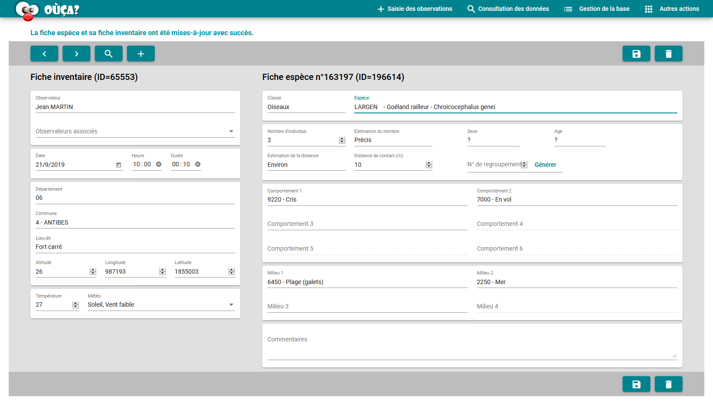
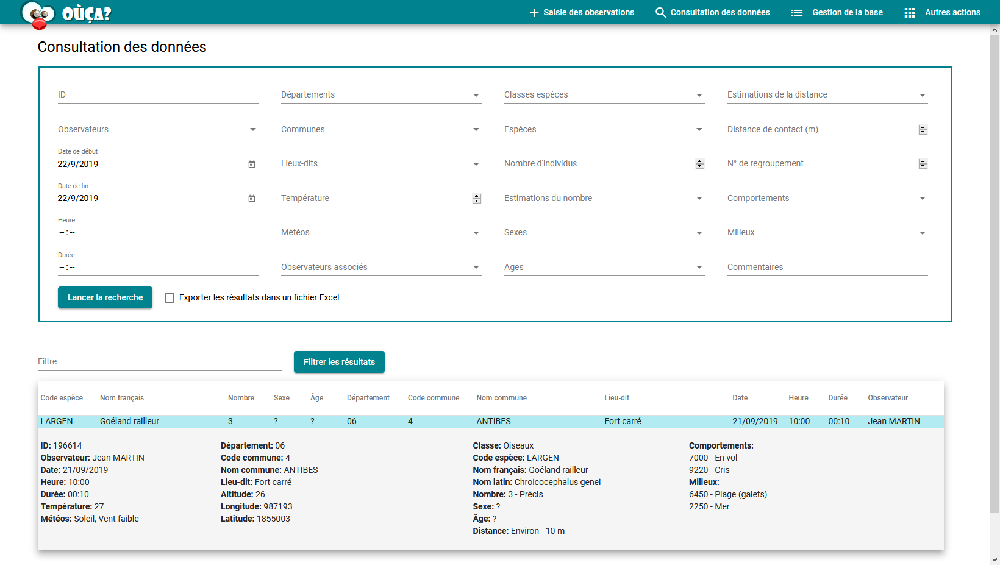
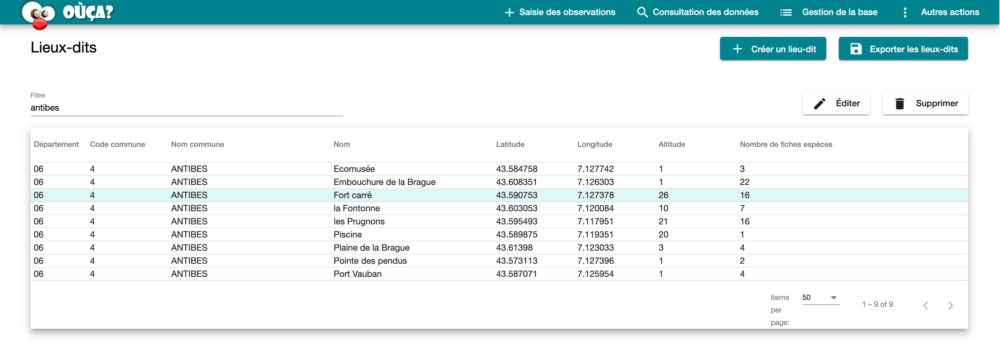

# Base Naturaliste (frontend)

This is the Angular frontend for Base Naturaliste application.

## About the project

The aim of the Base Naturaliste project is to provide naturalists a software where they can record and visualize their wildlife observations.

Each observation is identified by several characteristics filled in by the user: the context of the observation (e.g. date, location, weather) and the description of the observed specimens (e.g. species, age, behavior).

Gathering all these records permits naturalists to build a mapping of the fauna.

### Preview of the application

#### Recording of wildlife observations (Saisie des observations)

#### Data visualization (Consultation des données)

#### Geographical area management (Gestion des lieux-dits)

## Getting Started

This project is an Angular web application that connects to a dedicated backend API. You can find more information about this backend API in the backend project.

The application contains several features:

- Create, edit or remove data corresponding to a wildlife observation
- Search through the existing observations using advanced filtering
- Manage the different type of data related to the observations (observers, geographical area...)
- Import data from a CSV file
- Export data as a SQL dump file

### Dependencies and related projects

#### Dependencies

The objects exchanged between the backend and the frontend are defined in a common model:

- [Base Naturaliste (model)](https://github.com/alexandresoro/basenaturaliste-model)

#### Related projects

The backend for Base Naturaliste application which is called from this frontend:

- [Base Naturaliste (backend)](https://github.com/alexandresoro/basenaturaliste-backend)

### Run the project

On-going...

### Deployment

On-going...

## Authors

- [Camille Carrier](https://github.com/camillecarrier)
- [Alexandre Soro](https://github.com/alexandresoro)
